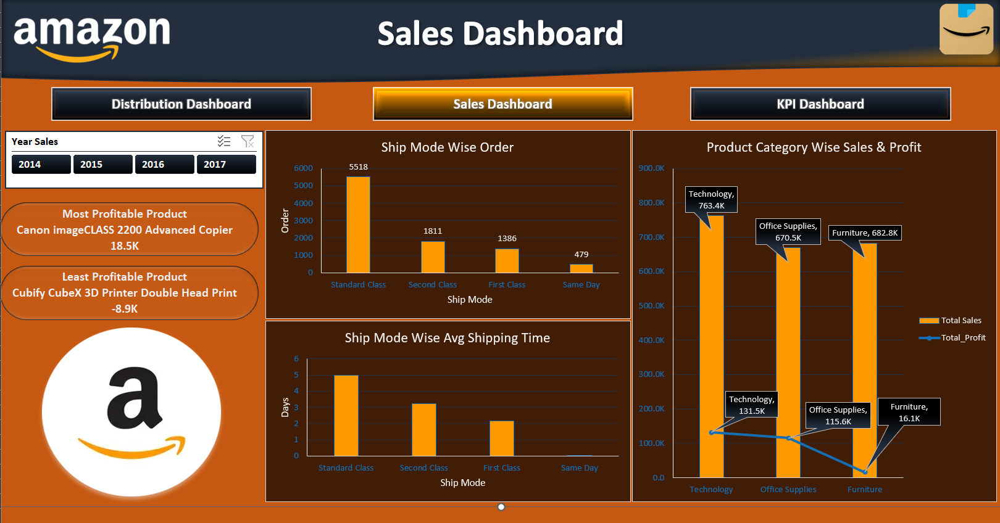
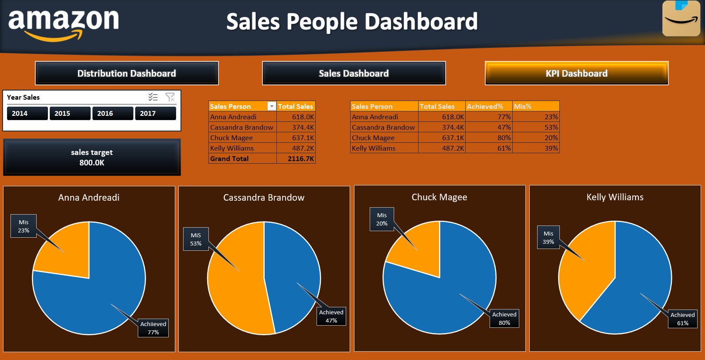
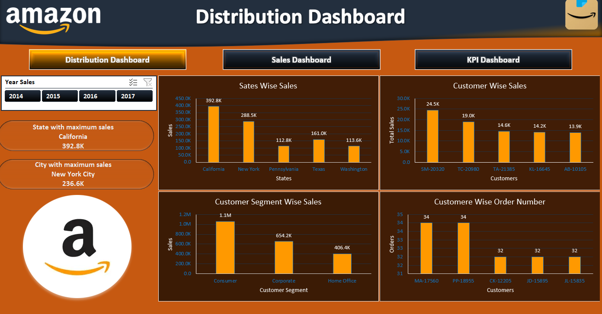

📦 Amazon Sales Dashboard — Excel

  
 
 <b>Interactive Excel Dashboard for Sales, Profitability & Customer Analysis</b> 
 
 📊 Data Analysis &nbsp; • &nbsp; 📈 Data Visualization &nbsp; • &nbsp; 🎛️ Interactive Dashboard &nbsp; • &nbsp; 📗 Microsoft Excel 

📌 Project Overview

The Amazon Sales Dashboard is an interactive Excel-based analytics project designed to analyze sales performance, profitability, shipping activity, customer segments, and geographic distribution.

The project contains three interconnected dashboard views that provide a comprehensive overview of sales performance and business activity.

📊 Dashboard Overview
👤 Sales People Dashboard

Analyzes individual salesperson performance using:

💰 Total Sales

🎯 Sales Target

📈 Achievement %

📉 Missed %

👤 Salesperson-wise Performance

📦 Sales Dashboard

Provides insights into sales, products, profitability, and shipping:

🚚 Ship Mode-wise Orders

⏱️ Average Shipping Time

📊 Category-wise Sales

💰 Category-wise Profit

🏆 Most Profitable Product

📉 Least Profitable Product

🌎 Distribution Dashboard

Analyzes sales distribution across customers and locations:

📍 State-wise Sales

🏙️ City-wise Sales

👥 Customer-wise Sales

🧩 Customer Segment-wise Sales

🔢 Customer-wise Order Count

🏆 Highest Sales State

🏙️ Highest Sales City

✨ Key Features

🎛️ Interactive Year Filter

📌 KPI Indicators

👤 Salesperson Performance Analysis

💰 Sales & Profit Analysis

📦 Product Performance Analysis

🚚 Shipping Analysis

🌎 Geographic Sales Analysis

👥 Customer Segmentation

📊 Interactive Dashboard Views

🛠️ Tools & Technologies

📗 Microsoft Excel

📊 Pivot Tables

📈 Pivot Charts

🎛️ Excel Slicers

🧮 Excel Formulas

📌 KPI Analysis

🎨 Data Visualization

🖼️ Dashboard Gallery

Click on any dashboard preview to open the full-size image.

👤 Sales People Dashboard

  
 
 <a href="./images/sales-people-dashboard.png">🔍 View Full Dashboard</a> 

📈 Sales Dashboard

  
 
 <a href="./images/sales-dashboard.png">🔍 View Full Dashboard</a> 

🌎 Distribution Dashboard

  
 
 <a href="./images/distribution-dashboard.png">🔍 View Full Dashboard</a> 

📊 Dashboard Components
👤 Sales Performance

Focuses on salesperson-level performance and target achievement.

Total Sales

Sales Target

Achievement Percentage

Missed Percentage

Individual Performance

📦 Product & Profitability

Provides product-level sales and profit analysis.

Product Category Sales

Product Category Profit

Most Profitable Product

Least Profitable Product

🚚 Shipping Analysis

Analyzes order distribution and shipping performance.

Ship Mode

Order Count

Average Shipping Time

👥 Customer Analysis

Provides insights into customer behavior and segmentation.

Customer-wise Sales

Customer Segment-wise Sales

Customer-wise Order Count

🌎 Geographic Analysis

Analyzes sales distribution across different locations.

State-wise Sales

City-wise Sales

Highest Sales State

Highest Sales City

🔄 Dashboard Workflow

1. 📄 Raw Sales Data

↓

2. 🧹 Data Preparation

↓

3. 📊 Pivot Tables

↓

4. 📈 Pivot Charts

↓

5. 🎛️ Interactive Slicers

↓

6. 📊 Dashboard Development

↓

7. 💡 Business Insights

📂 Project Structure

📊 Amazon Sales Dashboard

Main Excel workbook containing the complete dashboard and analysis.

📁 Images

🖼️ Sales People Dashboard

🖼️ Sales Dashboard

🖼️ Distribution Dashboard

📄 README.md

Project documentation and dashboard overview.

🎯 Project Purpose

The purpose of this project is to demonstrate practical skills in:

Excel-based data analysis

Business dashboard development

KPI reporting

Sales performance analysis

Product profitability analysis

Customer segmentation

Geographic sales analysis

Interactive data visualization

📚 Skills Demonstrated

Microsoft Excel
Data Analysis
Dashboard Development
Pivot Tables
Pivot Charts
Excel Slicers
KPI Analysis
Sales Analysis
Profitability Analysis
Customer Segmentation
Data Visualization

🚀 Project Highlights

     

📥 Excel Dashboard

  
 
 Click the button above to open or download the Excel dashboard. 

📌 Conclusion

The Amazon Sales Dashboard demonstrates how Microsoft Excel can be used to transform raw sales data into an interactive business reporting solution.

By combining KPIs, Pivot Tables, Pivot Charts, Slicers, sales analysis, profitability analysis, customer segmentation, and geographic insights, the project provides a structured approach to understanding business performance.

 <b>📊 Built with Microsoft Excel</b> 
 
 ⭐ If you find this project useful, consider giving the repository a star! 

