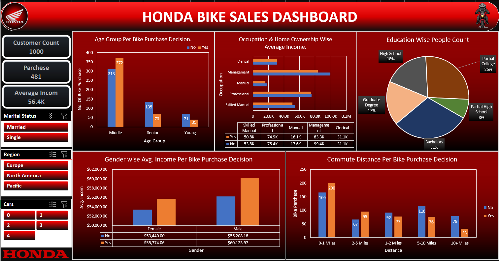

🏍️ Honda Bike Sales Dashboard — Excel

  
 
 <b>Interactive Excel Dashboard for Customer Demographics & Bike Purchase Analysis</b> 
 
 📊 Data Analysis &nbsp;•&nbsp; 📈 Data Visualization &nbsp;•&nbsp; 🎛️ Interactive Dashboard &nbsp;•&nbsp; 📗 Microsoft Excel 

📌 Project Overview

The Honda Bike Sales Dashboard is an interactive Microsoft Excel dashboard developed to analyze customer demographics, financial characteristics, and bike purchase behavior.

The dashboard transforms customer data into meaningful KPIs, demographic insights, income analysis, and purchase trends, helping users understand the factors associated with bike purchase decisions.

🎯 Project Objective

The primary objective of this project is to analyze customer characteristics and identify patterns related to bike purchase decisions.

The dashboard focuses on:

👥 Customer demographics

🏍️ Bike purchase behavior

💰 Customer income

💼 Occupation

🎓 Education

🚗 Cars owned

🏠 Home ownership

💍 Marital status

🚦 Commute distance

🌎 Regional differences

📊 Key Metrics
<table> <tr> <td align="center" width="33%">

👥

1,000

Customer Count

</td> <td align="center" width="33%">

🏍️

481

Bike Purchases

</td> <td align="center" width="33%">

💰

56.4K

Average Income

</td> </tr> </table>
📈 Dashboard Analysis

👥 Customer Overview

Provides an overall view of the customer base and key customer characteristics.

Total Customer Count

Bike Purchase Count

Average Customer Income

Customer segmentation

🏍️ Bike Purchase Analysis

Analyzes customer purchase decisions and identifies patterns across different customer segments.

The analysis includes:

Age group-wise purchase decisions

Commute distance-wise purchase behavior

Gender-wise purchase decisions

Regional purchase patterns

Customer characteristics associated with purchasing

👤 Customer Demographics

Analyzes the demographic composition of customers based on:

🎂 Age Group

⚧️ Gender

🎓 Education

💼 Occupation

💍 Marital Status

🏠 Home Ownership

🚗 Cars Owned

🌎 Region

💰 Financial Analysis

Examines customer income and its relationship with different customer characteristics and purchase decisions.

The dashboard analyzes:

Average income

Income by occupation

Income by gender

Income by purchase decision

Income by home ownership

🚦 Commute Distance Analysis

Analyzes bike purchase decisions based on customer commute distance.

This helps identify differences in purchase behavior across various commuting ranges.

🧩 Dashboard Components

📌 KPI Section

Provides a quick overview of the primary business metrics.

👥 Customer Count

🏍️ Total Bike Purchases

💰 Average Income

👤 Demographic Analysis

Provides insights into customer characteristics.

🎂 Age Group

⚧️ Gender

🎓 Education

💍 Marital Status

💼 Occupation

🏍️ Purchase Behavior

Analyzes factors associated with bike purchase decisions.

📊 Age Group-wise Purchase Decision

🚦 Commute Distance-wise Purchase Decision

⚧️ Gender-wise Purchase Decision

🌎 Region-wise Analysis

💰 Income Analysis

Examines income across different customer segments.

💼 Occupation & Home Ownership-wise Average Income

⚧️ Gender-wise Average Income

🏍️ Average Income by Purchase Decision

🚗 Customer Profile Analysis

Provides additional customer segmentation based on:

🏠 Home Ownership

🚗 Cars Owned

💍 Marital Status

🌎 Region

🛠️ Tools & Technologies

📗 Microsoft Excel

Used as the primary platform for data analysis, dashboard development, calculations, and visualization.

📊 Pivot Tables

Used to summarize customer information and analyze relationships between demographic and purchase variables.

📈 Pivot Charts

Used to visualize customer demographics, income patterns, and bike purchase behavior.

🎛️ Slicers

Used to create interactive filtering and allow users to explore different customer segments.

🧮 Excel Analysis

Used for KPI calculations, aggregation, segmentation, and supporting dashboard metrics.

🎨 Data Visualization

Used to transform customer data into clear and interactive business insights.

📂 Project Structure

- 📊 [**Honda Bike Sales Dashboard.xlsx**](./Honda_Bike_Sales_Dashboard.xlsx)
  - Main Excel workbook containing the interactive dashboard, Pivot Tables, Pivot Charts, and analysis.

- 📁 [**Images**](./Images/)
  - 🖼️ [**Dashboard Preview**](./Images/honda-bike-sales-dashboard.png)

- 📄 [**README.md**](./README.md)
  - Project documentation and dashboard overview.

🔄 Dashboard Workflow

1️⃣ 📄 Raw Customer Data

Collect and organize customer demographic, financial, and purchase information.

↓

2️⃣ 🧹 Data Preparation

Prepare the dataset for analysis and dashboard development.

↓

3️⃣ 📊 Pivot Tables

Summarize customer characteristics, income, and purchase decisions.

↓

4️⃣ 📈 Pivot Charts

Convert analyzed data into meaningful visualizations.

↓

5️⃣ 🎛️ Interactive Filters

Use slicers to explore different customer segments.

↓

6️⃣ 🏍️ Excel Dashboard

Combine KPIs, charts, and interactive filters into a centralized dashboard.

↓

7️⃣ 💡 Business Insights

Identify patterns in customer characteristics and bike purchase behavior.

📌 Key Analysis Areas

👥 Customer Demographics

Analysis of:

Age groups

Gender

Education

Marital status

Occupation

Home ownership

Cars owned

Region

🏍️ Purchase Behavior

Analysis of:

Bike purchase decisions

Age group-wise purchasing

Commute distance

Gender-wise purchasing

Regional differences

💰 Financial Analysis

Analysis of:

Average income

Income by gender

Income by occupation

Income by home ownership

Income by purchase decision

💡 Business Insights

The dashboard provides a centralized view of customer characteristics and their relationship with bike purchase behavior.

It can be used to explore:

Which customer segments show different purchase patterns

How income varies across different customer groups

How commute distance relates to purchase decisions

How demographic characteristics differ between purchasing groups

How customer profiles vary across regions

📚 Skills Demonstrated

This project demonstrates practical skills in:

📊 Data Analysis

📈 Data Visualization

📗 Microsoft Excel

📌 KPI Development

📊 Pivot Tables

📈 Pivot Charts

🎛️ Slicers

🧮 Excel Formulas

👥 Customer Segmentation

💰 Financial Analysis

🏍️ Purchase Behavior Analysis

🎨 Dashboard Design

📋 Business Reporting

🚀 Project Highlights
<table> <tr> <td align="center" width="25%">

👥

1,000

Customer Count

</td> <td align="center" width="25%">

🏍️

481

Bike Purchases

</td> <td align="center" width="25%">

💰

56.4K

Average Income

</td> <td align="center" width="25%">

📗

Excel

Platform

</td> </tr> <tr> <td align="center" colspan="4">

📊 Dashboard Type: Interactive Excel Dashboard

</td> </tr> </table>
🖼️ Dashboard Preview

  

🎓 What I Learned

This project demonstrates how customer data can be transformed into an interactive Excel dashboard for business analysis.

Through this project, I strengthened my understanding of:

Customer segmentation

Demographic analysis

Purchase behavior analysis

Income-based analysis

KPI development

Pivot Tables and Pivot Charts

Interactive Excel dashboards

Data visualization

Business-oriented reporting

📌 Conclusion

The Honda Bike Sales Dashboard demonstrates how Microsoft Excel can be used to transform customer data into an interactive and visually engaging analytical solution.

By combining KPIs, Pivot Tables, Pivot Charts, demographic analysis, income analysis, and interactive filters, the dashboard provides a structured view of customer characteristics and bike purchase behavior.

⭐ Support

If you found this project useful or interesting, consider giving the repository a ⭐ Star.

 <b>🏍️ Built with Microsoft Excel</b> 

