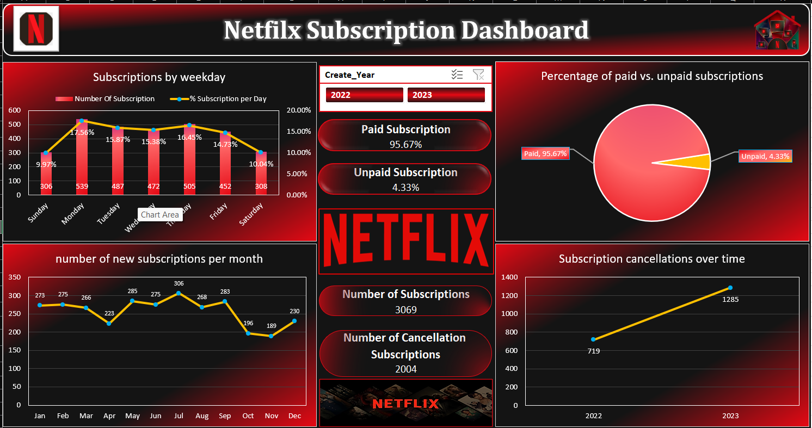

🎬 Netflix Subscription Dashboard — Excel

  
 
 <b>Interactive Excel Dashboard for Subscription, Payment & Cancellation Analysis</b> 
 
 📊 Data Analysis &nbsp;•&nbsp; 📈 Data Visualization &nbsp;•&nbsp; 🎛️ Interactive Dashboard &nbsp;•&nbsp; 📗 Microsoft Excel 

📌 Project Overview

The Netflix Subscription Dashboard is an interactive Microsoft Excel dashboard developed to analyze subscription activity, payment status, new subscriptions, and cancellations.

The dashboard transforms raw subscription data into meaningful KPIs, charts, trends, and interactive filters, making it easier to understand subscription behavior and monitor business performance.

🎯 Project Objective

The main objective of this project is to analyze Netflix subscription activity and identify patterns in:

📅 Subscription activity across weekdays

📈 New subscriptions by month

💳 Paid and unpaid subscriptions

❌ Subscription cancellations

📆 Year-wise subscription trends

🔢 Overall subscription KPIs

The project demonstrates how Microsoft Excel can be used as a business intelligence and data visualization tool.

📊 Key Metrics

👥	❌	💳	⚠️
3,069	2,004	95.67%	4.33%
Total Subscriptions	Total Cancellations	Paid Subscriptions	Unpaid Subscriptions

📈 Dashboard Analysis
📅 1. Subscriptions by Weekday

Analyzes subscription activity across different days of the week.

This helps identify how subscription activity is distributed throughout the week.

📊 2. Subscription Percentage by Day

Shows the percentage contribution of each weekday to the overall subscription activity.

This provides a clearer understanding of the distribution of subscriptions across different days.

💳 3. Paid vs. Unpaid Subscriptions

The dashboard provides an overview of subscription payment status.

💳 Paid Subscriptions       95.67%
⚠️ Unpaid Subscriptions      4.33%

This allows users to quickly understand the overall payment distribution.

📈 4. New Subscriptions by Month

The monthly subscription trend visualizes how new subscriptions change over time.

It helps identify:

Monthly growth patterns

High subscription periods

Low subscription periods

Changes in subscription activity

❌ 5. Subscription Cancellations

The cancellation analysis tracks subscription cancellations over time.

This helps visualize cancellation activity and understand how it changes across the available period.

📆 6. Year-wise Analysis

The dashboard contains subscription data for:

2022
 │
 ├── Subscription Analysis
 ├── Payment Analysis
 └── Cancellation Analysis
     
2023
 │
 ├── Subscription Analysis
 ├── Payment Analysis
 └── Cancellation Analysis

An interactive Year Slicer allows users to filter the dashboard and analyze individual years.

✨ Dashboard Features
🎛️ Interactive Filtering

The dashboard includes an interactive Year Slicer that allows users to switch between:

2022

2023

📌 KPI Cards

The dashboard displays important business metrics at a glance:

👥 Total Subscriptions

❌ Total Cancellations

💳 Paid Subscriptions

⚠️ Unpaid Subscriptions

📊 Interactive Charts

Different charts are used to visualize:

Weekly subscription activity

Subscription percentages

Monthly new subscriptions

Cancellation trends

Payment status

🧩 Dashboard Components
🎬 Netflix Subscription Dashboard
│
├── 📌 KPI Section
│   ├── 👥 Total Subscriptions
│   └── ❌ Total Cancellations
│
├── 💳 Payment Analysis
│   ├── 💚 Paid Subscriptions
│   └── ⚠️ Unpaid Subscriptions
│
├── 📅 Weekly Analysis
│   ├── Subscriptions by Weekday
│   └── Subscription Percentage by Day
│
├── 📈 Monthly Analysis
│   └── New Subscriptions by Month
│
├── ❌ Cancellation Analysis
│   └── Cancellation Trend Over Time
│
└── 🎛️ Interactive Filters
    └── Year Slicer
        ├── 2022
        └── 2023

🛠️ Tools & Technologies
📗 Microsoft Excel

Primary tool used for:

Data analysis

Calculations

Dashboard development

Data visualization

📊 Pivot Tables

Used to summarize and analyze subscription data across different dimensions.

📈 Pivot Charts

Used to convert summarized data into visual charts and identify trends.

🎛️ Slicers

Used to provide interactive filtering and allow users to analyze data by year.

🧮 Excel Formulas

Used for:

KPI calculations

Percentage calculations

Data processing

Supporting dashboard metrics

🎨 Data Visualization

Used to present complex subscription data in a simple and understandable format.

🗓️ Data Period

The dashboard covers subscription activity for:

📅 2022
   │
   └── Subscription & Cancellation Analysis

📅 2023
   │
   └── Subscription & Cancellation Analysis

📂 Project Structure
📁 Netflix-Subscription-Dashboard
│
├── 📊 Netflix Subscription Dashboard.xlsx
│   │
│   ├── 📄 Raw Data
│   │
│   ├── 📊 Pivot Tables
│   │
│   ├── 📈 Pivot Charts
│   │
│   └── 🎛️ Interactive Dashboard
│
├── 📁 images
│   │
│   └── 🖼️ netflix-subscription-dashboard.png
│
└── 📄 README.md

🔄 Dashboard Workflow
            📄 Raw Subscription Data
                     │
                     ▼
             🧹 Data Preparation
                     │
                     ▼
              📊 Pivot Tables
                     │
                     ▼
               📈 Pivot Charts
                     │
                     ▼
              🎛️ Interactive
                 Slicers
                     │
                     ▼
          🎬 Excel Dashboard
                     │
                     ▼
          📊 Business Insights

💡 Business Use Case

A subscription analytics dashboard can help businesses monitor important subscription-related metrics such as:

New customer acquisition

Payment completion

Subscription activity

Cancellation activity

Monthly trends

Year-wise performance

The dashboard provides a centralized view of these metrics for easier analysis and reporting.

📚 Skills Demonstrated

Through this project, the following skills are demonstrated:

📊 Data Analysis

📈 Data Visualization

📗 Microsoft Excel

🔢 KPI Development

📊 Pivot Tables

📈 Pivot Charts

🎛️ Slicers

🧮 Excel Formulas

🎨 Dashboard Design

📅 Trend Analysis

📋 Business Reporting

🚀 Key Highlights
┌─────────────────────────────────────────────┐
│              PROJECT HIGHLIGHTS             │
├─────────────────────────────────────────────┤
│                                             │
│  👥 Total Subscriptions       3,069         │
│  ❌ Total Cancellations       2,004         │
│  💳 Paid Subscriptions       95.67%         │
│  ⚠️ Unpaid Subscriptions      4.33%         │
│  📅 Data Period               2022–2023     │
│  📗 Platform                  Excel         │
│                                             │
└─────────────────────────────────────────────┘

🎓 What I Learned

This project helped demonstrate how raw business data can be transformed into an interactive analytical dashboard using Microsoft Excel.

Key learning areas include:

Building interactive Excel dashboards

Creating KPI metrics

Working with Pivot Tables and Pivot Charts

Using Slicers for interactive filtering

Analyzing subscription and cancellation trends

Designing clean and user-friendly visual reports

Presenting business data in a meaningful way

🖼️ Dashboard Preview

  

📌 Conclusion

The Netflix Subscription Dashboard demonstrates the use of Microsoft Excel for data analysis, KPI reporting, trend analysis, interactive filtering, and business data visualization.

By combining Pivot Tables, Pivot Charts, formulas, and Slicers, the project converts subscription data into an interactive dashboard that makes important trends and metrics easier to understand.

⭐ Support

If you found this project useful or interesting, consider giving the repository a ⭐ Star.

 <b>📊 Built with Microsoft Excel</b> 

