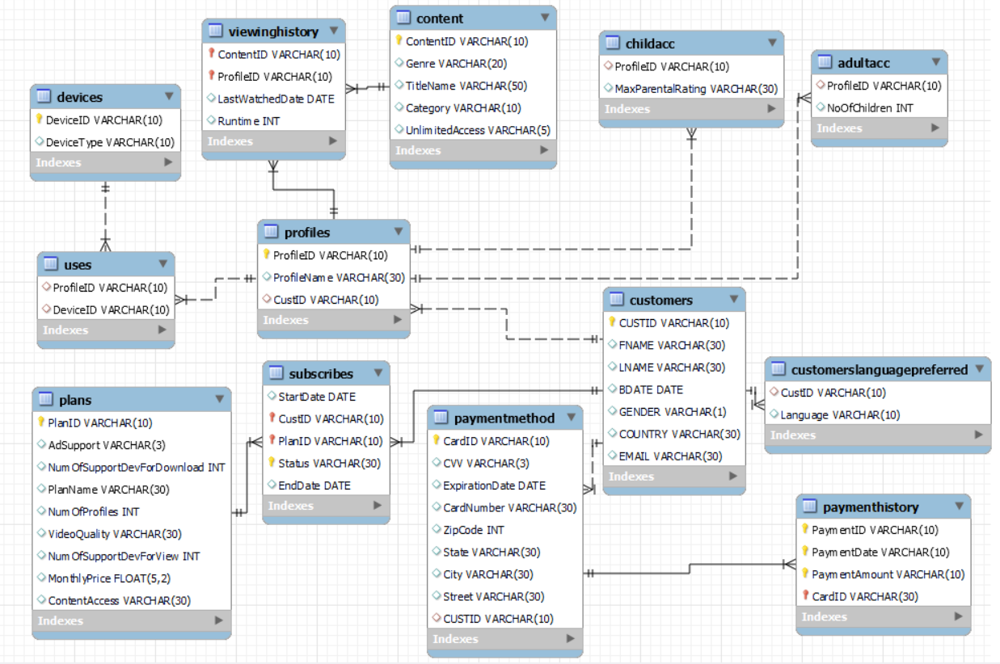

# 🎬 Netflix MySQL Data Analytics

<p align="center">
  
  
  
  
</p>

<p align="center">
  <strong>Relational Database Design • SQL Analytics • Business Analysis</strong>
</p>

<p align="center">
  A practical MySQL project focused on customers, subscriptions,
  content, viewing behavior, profiles, devices, payments, and revenue analysis.
</p>

<p align="center">
  <a href="./netflix_database.sql">📄 View SQL Script</a>
  &nbsp;&nbsp;•&nbsp;&nbsp;
  <a href="./schema/netflix_schema.png">🗺️ View Database Schema</a>
</p>

---

# 📖 Project Overview

The **Netflix MySQL Data Analytics Project** is a relational database and SQL analysis project designed around a Netflix-style streaming platform.

The project uses **MySQL and SQL** to create, populate, connect, and analyze a relational database containing information related to:

- 👤 Customers
- 🌐 Customer Language Preferences
- 💳 Payment Methods
- 📦 Subscription Plans
- 🎬 Content
- 🔄 Subscriptions
- 💰 Payment History
- 👥 Profiles
- 👶 Child Accounts
- 🧑 Adult Accounts
- 📺 Viewing History
- 📱 Devices
- 🔗 Profile-Device Usage

The database contains **13 relational tables** and the SQL file includes **15 analytical questions** covering content viewing, subscriptions, devices, customers, profiles, payments, revenue, and viewing behavior.

> **Project interpretation:** The database represents a Netflix-style streaming platform based on the entities and relationships defined in the SQL schema. The project focuses on SQL/database learning and analysis rather than claiming to represent Netflix's actual internal database.

---

# 🎯 Project Objective

The main objective of this project is to develop practical knowledge of:

- MySQL
- SQL
- Relational database design
- Database relationships
- Data aggregation
- SQL joins
- Subqueries
- Common Table Expressions
- Window functions
- Ranking analysis
- Customer analysis
- Subscription analysis
- Content analysis
- Viewing-history analysis
- Payment and revenue analysis

### Key Objectives

- Design a relational database
- Create and manage database tables
- Define Primary Keys and Foreign Keys
- Work with composite primary keys
- Insert sample records
- Connect related tables using JOINs
- Perform aggregation and grouping
- Analyze customer and profile information
- Analyze subscription plans
- Analyze content and viewing behavior
- Analyze payment and revenue information
- Use subqueries for advanced analysis
- Use CTEs to structure complex queries
- Use window functions for ranking analysis

---

# 📊 Project Snapshot

| Category | Details |
|---|---|
| 🗄️ **Database** | `netflix` |
| 🐬 **DBMS** | MySQL |
| 📝 **Language** | SQL |
| 🗃️ **Tables** | 13 |
| 📊 **Analysis Questions** | 15 |
| 🔗 **Database Type** | Relational Database |
| 🖼️ **Schema** | Included |
| 📄 **SQL Script** | Included |
| 🧠 **Advanced SQL** | CTEs, Subqueries & Window Functions |
| 🎯 **Main Focus** | Customers, Content, Subscriptions, Viewing & Payments |

---

# 🗄️ Database Overview

The SQL script creates a database named:

```sql
netflix
```

The database is initialized using:

```sql
DROP DATABASE IF EXISTS netflix;

CREATE DATABASE netflix;

USE netflix;
```

The database contains 13 related tables covering different areas of the streaming-platform model.

### Main Data Areas

```text
Customers
    ↓
Profiles
    ↓
Viewing History
    ↓
Content
```

```text
Customers
    ↓
Subscriptions
    ↓
Plans
```

```text
Customers
    ↓
Payment Methods
    ↓
Payment History
```

```text
Profiles
    ↓
Uses
    ↓
Devices
```

These relationships allow information from multiple tables to be combined for SQL analysis.

---

# 🗃️ Database Tables

The database contains **13 tables**.

| # | Table | Purpose |
|---:|---|---|
| 01 | `Customers` | Stores customer information |
| 02 | `CustomersLanguagePreferred` | Stores customer language preferences |
| 03 | `Plans` | Stores subscription plan information |
| 04 | `PaymentMethod` | Stores customer payment-method information |
| 05 | `Content` | Stores content information |
| 06 | `Subscribes` | Stores customer subscription information |
| 07 | `PaymentHistory` | Stores payment transaction information |
| 08 | `Profiles` | Stores customer profile information |
| 09 | `ChildAcc` | Stores child-account/profile information |
| 10 | `AdultAcc` | Stores adult-account/profile information |
| 11 | `ViewingHistory` | Stores content-viewing information |
| 12 | `Devices` | Stores device information |
| 13 | `Uses` | Connects profiles with devices |

---

# 🖼️ Database Schema

The database schema represents the structure of the project and shows how the different tables are connected.

<p align="center">
  
</p>

<p align="center">
  <a href="./schema/netflix_schema.png">
    🔍 View Full-Size Schema
  </a>
</p>

---

# 🔗 Table Relationships

The database contains several relationships between customers, profiles, subscriptions, payments, content, viewing history, and devices.

### Customer → Language Preference

```text
Customers.CustID
       │
       ▼
CustomersLanguagePreferred.CustID
```

Connects customers with their preferred languages.

---

### Customer → Payment Method

```text
Customers.CustID
       │
       ▼
PaymentMethod.CUSTID
```

Connects customers with their payment methods.

---

### Customer → Subscription

```text
Customers.CUSTID
       │
       ▼
Subscribes.CUSTID
```

Connects customers with their subscription records.

---

### Plan → Subscription

```text
Plans.PLANID
       │
       ▼
Subscribes.PLANID
```

Connects subscription records with subscription plans.

---

### Payment Method → Payment History

```text
PaymentMethod.CardID
       │
       ▼
PaymentHistory.CardID
```

Connects payment transactions with payment methods.

---

### Customer → Profiles

```text
Customers.CUSTID
       │
       ▼
Profiles.CUSTID
```

Connects customers with their profiles.

---

### Profile → Child Account

```text
Profiles.ProfileID
       │
       ▼
ChildAcc.ProfileID
```

Connects profiles with child-account records.

---

### Profile → Adult Account

```text
Profiles.ProfileID
       │
       ▼
AdultAcc.ProfileID
```

Connects profiles with adult-account records.

---

### Content → Viewing History

```text
Content.ContentID
       │
       ▼
ViewingHistory.ContentID
```

Connects content with viewing records.

---

### Profile → Viewing History

```text
Profiles.ProfileID
       │
       ▼
ViewingHistory.ProfileID
```

Connects profiles with their viewing history.

---

### Device → Profile Usage

```text
Devices.DeviceID
       │
       ▼
Uses.DeviceID
```

Connects devices with profile usage.

---

### Profile → Device Usage

```text
Profiles.ProfileID
       │
       ▼
Uses.ProfileID
```

Connects profiles with device usage.

---

# 📈 Business Questions & Analysis

The SQL file contains **15 analysis questions**.

These questions cover:

- 🎬 Content analysis
- 📺 Viewing behavior
- 📦 Subscription analysis
- 📱 Device analysis
- 👤 Customer analysis
- 👥 Profile analysis
- 💳 Payment analysis
- 💰 Revenue analysis

| # | Analysis Question | Purpose |
|---:|---|---|
| 01 | 🎬 Top 3 Most-Watched Movies | Finds the top movies based on total viewing hours |
| 02 | 🎭 Top Genre in Each Category | Finds the highest-ranked genre within each category |
| 03 | 📦 Subscriptions for Each Plan | Analyzes subscription records associated with plans |
| 04 | 📱 Most Commonly Used Device Type | Finds the most frequently used device type |
| 05 | ⏱️ Average Viewing Time | Compares average viewing time for movies and TV shows |
| 06 | 🌐 Most Preferred Customer Language | Finds the most frequently preferred customer language |
| 07 | 👨‍👧 Adult vs Child Accounts | Compares customers associated with adult and child accounts |
| 08 | 👥 Average Profiles per Customer | Calculates the average number of profiles per customer |
| 09 | 🎬 Lowest Average Viewing Time | Finds content with the lowest average viewing time |
| 10 | 📚 Content Count by Category | Counts content items within each category |
| 11 | ♾️ Unlimited vs Non-Unlimited Access | Identifies customers by content-access type |
| 12 | 💰 Average Price of Unlimited Plans | Calculates average monthly price for unlimited plans |
| 13 | 💳 Payment Methods Expiring in 2028+ | Finds customers with payment methods expiring from 2028 onward |
| 14 | 🏙️ Average Revenue by City | Calculates and ranks average payment amounts by city |
| 15 | 🔞 Adult Genre Viewing Analysis | Finds the most frequently viewed genre among adults by category |

---

# 🔍 Analysis Details

<details>
<summary><strong>01 — Top 3 Most-Watched Movies</strong></summary>

### Question

Find the top 3 most-watched movies based on total viewing hours.

### Explanation

Identifies the three movies with the highest total viewing time.

### SQL Concepts

```text
JOIN
SUM()
GROUP BY
ORDER BY
LIMIT
```

</details>

---

<details>
<summary><strong>02 — Top Genre in Each Category</strong></summary>

### Question

Find the top genre in each category using ranking.

### Explanation

Ranks genres within each content category and identifies the highest-ranked genre.

### SQL Concepts

```text
CTE
RANK()
PARTITION BY
GROUP BY
```

</details>

---

<details>
<summary><strong>03 — Subscriptions for Each Plan</strong></summary>

### Question

Analyze subscriptions associated with each subscription plan.

### Explanation

Connects subscription records with plans and summarizes subscription activity.

### SQL Concepts

```text
JOIN
GROUP BY
COUNT()
```

</details>

---

<details>
<summary><strong>04 — Most Commonly Used Device Type</strong></summary>

### Question

Find the device type that is used most frequently.

### Explanation

Counts device usage records and identifies the most frequently appearing device type.

### SQL Concepts

```text
JOIN
COUNT()
GROUP BY
ORDER BY
```

</details>

---

<details>
<summary><strong>05 — Average Viewing Time: Movies vs TV Shows</strong></summary>

### Question

Calculate the average viewing time for movies and TV shows.

### Explanation

Compares average viewing duration between different content types.

### SQL Concepts

```text
JOIN
AVG()
GROUP BY
```

</details>

---

<details>
<summary><strong>06 — Most Preferred Customer Language</strong></summary>

### Question

Find the language most preferred by customers.

### Explanation

Counts customer language preferences and identifies the most frequently appearing language.

### SQL Concepts

```text
JOIN
COUNT()
GROUP BY
ORDER BY
```

</details>

---

<details>
<summary><strong>07 — Adult vs Child Account Customers</strong></summary>

### Question

Compare the number of customers associated with adult and child accounts.

### Explanation

Uses separate account information and combines the results for comparison.

### SQL Concepts

```text
JOIN
COUNT()
UNION ALL
```

</details>

---

<details>
<summary><strong>08 — Average Number of Profiles per Customer</strong></summary>

### Question

Calculate the average number of profiles associated with each customer.

### Explanation

Calculates profile counts per customer and then derives the overall average.

### SQL Concepts

```text
Subquery
COUNT()
AVG()
GROUP BY
```

</details>

---

<details>
<summary><strong>09 — Content with the Lowest Average Viewing Time</strong></summary>

### Question

Find the content with the lowest average viewing time per user.

### Explanation

Calculates average viewing duration for content and identifies the lowest average.

### SQL Concepts

```text
JOIN
AVG()
GROUP BY
ORDER BY
```

</details>

---

<details>
<summary><strong>10 — Content Count by Category</strong></summary>

### Question

Calculate the number of content items available in each category.

### Explanation

Groups content by category and counts the records in each category.

### SQL Concepts

```text
COUNT()
GROUP BY
ORDER BY
```

</details>

---

<details>
<summary><strong>11 — Unlimited vs Non-Unlimited Content Access</strong></summary>

### Question

Find customers with unlimited and non-unlimited content access.

### Explanation

Uses subscription-plan information to identify customers according to their content-access type.

### SQL Concepts

```text
JOIN
WHERE
DISTINCT
```

</details>

---

<details>
<summary><strong>12 — Average Monthly Price of Unlimited Plans</strong></summary>

### Question

Calculate the average monthly price of plans that provide unlimited content access.

### Explanation

Filters unlimited-access plans and calculates their average monthly price.

### SQL Concepts

```text
AVG()
WHERE
HAVING
```

</details>

---

<details>
<summary><strong>13 — Customers with Payment Methods Expiring in 2028 or Later</strong></summary>

### Question

Find customers whose payment-method expiration year is 2028 or later.

### Explanation

Extracts the expiration year and filters payment methods according to the specified year.

### SQL Concepts

```text
JOIN
YEAR()
CONCAT()
ORDER BY
```

</details>

---

<details>
<summary><strong>14 — Average Revenue by City and City Ranking</strong></summary>

### Question

Calculate the average payment amount by city and rank cities based on average revenue.

### Explanation

Calculates average payment amounts for cities and uses ranking to compare city-level results.

### SQL Concepts

```text
JOIN
AVG()
GROUP BY
RANK()
PARTITION BY
```

</details>

---

<details>
<summary><strong>15 — Most Frequently Viewed Genre Among Adults</strong></summary>

### Question

Find the most frequently viewed genre among adult profiles for each content category.

### Explanation

Filters adult profile viewing activity and ranks genres within each category.

### SQL Concepts

```text
JOIN
Subquery
RANK()
PARTITION BY
GROUP BY
```

</details>

---

# 🧠 SQL Concepts Used

This project demonstrates both fundamental and advanced SQL concepts.

---

## 🏗️ 1. DDL — Data Definition Language

Used to create and manage database structures.

```sql
DROP DATABASE
CREATE DATABASE
USE
DROP TABLE
CREATE TABLE
```

---

## 📝 2. DML — Data Manipulation Language

Used to insert records into the database.

```sql
INSERT INTO
```

---

## 🔗 3. SQL JOINs

JOINs are used to combine related information stored across multiple tables.

```sql
JOIN
```

---

## 📊 4. Aggregate Functions

Used to summarize and calculate metrics.

```sql
COUNT()
COUNT(DISTINCT)
SUM()
AVG()
ROUND()
```

---

## 🔍 5. Filtering

Used to retrieve records according to specific conditions.

```sql
WHERE
DISTINCT
```

---

## 📋 6. Grouping & Sorting

Used to organize analytical results.

```sql
GROUP BY
ORDER BY
HAVING
LIMIT
```

---

## 🧩 7. Common Table Expressions

The project uses:

```sql
WITH
```

CTEs help break complex analysis into logical steps.

---

## 🏆 8. Window Functions

The project uses:

```sql
RANK() OVER()
```

Window functions allow ranking records while retaining the underlying grouped information.

---

## 📌 9. PARTITION BY

Used with window functions to perform rankings within specific groups.

```sql
PARTITION BY
```

For example, ranking genres separately within each content category.

---

## 🔄 10. UNION ALL

Used to combine results from multiple queries.

```sql
UNION ALL
```

---

## 🔎 11. Subqueries

Subqueries are used when the result of one query is required by another query.

They are useful for more complex analytical calculations and filtering.

---

## 🔑 12. Database Keys

The database demonstrates:

```text
Primary Keys
Foreign Keys
Composite Primary Keys
```

Composite primary keys are used in selected tables where multiple columns together identify a record.

---

# 🛠️ Tools & Technologies

| Tool / Technology | Purpose |
|---|---|
| 🐬 **MySQL** | Relational database management |
| 📝 **SQL** | Data querying and analysis |
| 💻 **MySQL Workbench** | SQL development and execution |
| 🗄️ **Relational Database** | Structured data organization |
| 🔗 **Primary & Foreign Keys** | Establishing table relationships |
| 📊 **SQL Analytics** | Data analysis and business-oriented querying |

---

# 🔄 Project Workflow

The project follows a structured database and SQL analytics workflow.

```text
        ┌─────────────────────────┐
        │   Database Planning     │
        └────────────┬────────────┘
                     ↓
        ┌─────────────────────────┐
        │    Create Database      │
        └────────────┬────────────┘
                     ↓
        ┌─────────────────────────┐
        │     Create Tables       │
        │       13 Tables         │
        └────────────┬────────────┘
                     ↓
        ┌─────────────────────────┐
        │ Define Keys & Relations │
        │ Primary / Foreign Keys  │
        └────────────┬────────────┘
                     ↓
        ┌─────────────────────────┐
        │     Insert Data         │
        └────────────┬────────────┘
                     ↓
        ┌─────────────────────────┐
        │    Explore Database     │
        └────────────┬────────────┘
                     ↓
        ┌─────────────────────────┐
        │     Write SQL Queries   │
        └────────────┬────────────┘
                     ↓
        ┌─────────────────────────┐
        │   Aggregate & Filter    │
        └────────────┬────────────┘
                     ↓
        ┌─────────────────────────┐
        │    Advanced SQL         │
        │ CTE • Subquery • Rank   │
        └────────────┬────────────┘
                     ↓
        ┌─────────────────────────┐
        │      Analyze Results    │
        └─────────────────────────┘
```

---

# 🔢 Workflow Steps

### 1️⃣ Database Creation

Create the `netflix` database.

### 2️⃣ Table Creation

Create the 13 tables required for the project.

### 3️⃣ Keys & Relationships

Define primary keys, foreign keys, and composite primary keys where specified in the SQL schema.

### 4️⃣ Data Insertion

Insert the sample records provided in the SQL file.

### 5️⃣ Database Exploration

Explore customers, profiles, content, subscriptions, devices, viewing history, and payment information.

### 6️⃣ Query Development

Develop SQL queries to answer the 15 analytical questions.

### 7️⃣ Data Aggregation

Use functions such as:

```sql
COUNT()
SUM()
AVG()
ROUND()
```

to summarize data.

### 8️⃣ Advanced SQL Analysis

Apply:

```text
CTEs
Subqueries
RANK()
PARTITION BY
UNION ALL
```

where required.

### 9️⃣ Analytical Interpretation

Use the query results to examine customers, content, subscriptions, viewing behavior, devices, payments, and revenue.

---

# 📥 How to Download the Project

## Option 1 — Download ZIP

1. Open the GitHub repository.
2. Click the **Code** button.
3. Select **Download ZIP**.
4. Extract the downloaded ZIP file.
5. Open the project folder.

The project will be located at:

```text
Data-Analytics-Portfolio/
└── MySQL/
    └── netflix-mysql-data-analytics/
```

---

## Option 2 — Clone the Repository

If Git is installed, open **Git Bash** or **Command Prompt** and run:

```bash
git clone https://github.com/YogirajSharma/Data-Analytics-Portfolio.git
```

Then navigate to:

```text
Data-Analytics-Portfolio/MySQL/netflix-mysql-data-analytics/
```

---

# ▶️ How to Run the SQL Project

## Step 1 — Install MySQL

Install:

- MySQL Server
- MySQL Workbench

Make sure the MySQL Server is running.

---

## Step 2 — Open MySQL Workbench

Open **MySQL Workbench** and connect to your MySQL Server.

---

## Step 3 — Open the SQL File

Open:

```text
netflix_database.sql
```

In MySQL Workbench:

```text
File
  ↓
Open SQL Script
  ↓
netflix_database.sql
```

---

## Step 4 — Execute the Script

Click the **Execute** button in MySQL Workbench.

The script contains commands for:

1. Creating the `netflix` database
2. Creating database tables
3. Defining relationships
4. Inserting sample records
5. Running the included SQL analysis queries

---

## Step 5 — Refresh the Schema

Refresh the **Schemas** section in MySQL Workbench.

You should see:

```text
netflix
│
├── Customers
├── CustomersLanguagePreferred
├── Plans
├── PaymentMethod
├── Content
├── Subscribes
├── PaymentHistory
├── Profiles
├── ChildAcc
├── AdultAcc
├── ViewingHistory
├── Devices
└── Uses
```

---

## Step 6 — Run Individual Analysis Queries

The SQL file contains 15 analysis questions.

For learning purposes:

```text
Read the Question
       ↓
Identify Required Tables
       ↓
Understand Relationships
       ↓
Write / Read the SQL Query
       ↓
Execute the Query
       ↓
Review the Result
```

This makes the project useful for practicing SQL step by step.

---

# 🎓 Key Learning Areas

## 🗄️ 1. Relational Database Design

Understanding how different entities can be represented using separate but related tables.

---

## 🔑 2. Primary & Foreign Keys

Understanding how keys identify records and establish relationships between tables.

---

## 🧩 3. Composite Primary Keys

Understanding how multiple columns can collectively identify a record.

---

## 🔗 4. SQL JOINs

Learning how to combine information from multiple related tables.

---

## 📊 5. Aggregate Functions

Using:

```sql
COUNT()
SUM()
AVG()
ROUND()
```

to calculate analytical metrics.

---

## 🔍 6. Filtering

Using conditions to retrieve specific records.

```sql
WHERE
```

---

## 📋 7. Grouping & Sorting

Using:

```sql
GROUP BY
ORDER BY
HAVING
```

to organize analytical results.

---

## 🔎 8. Subqueries

Using queries inside other queries for advanced analysis.

---

## 🧱 9. Common Table Expressions

Using:

```sql
WITH
```

to structure complex SQL queries.

---

## 🏆 10. Window Functions

Using:

```sql
RANK() OVER()
```

to perform ranking analysis.

---

## 📌 11. PARTITION BY

Performing window-function calculations separately within groups.

---

## 🔄 12. UNION ALL

Combining results from multiple queries.

---

## 🎬 13. Content & Viewing Analysis

Analyzing content categories, genres, viewing time, and viewing behavior.

---

## 👤 14. Customer & Profile Analysis

Analyzing customers, preferred languages, profiles, and account types.

---

## 📦 15. Subscription Analysis

Analyzing plans, subscription records, and content-access types.

---

## 💳 16. Payment & Revenue Analysis

Analyzing payment methods, payment history, payment amounts, and city-level average payment values.

---

# 💼 Skills Demonstrated

Through this project, the following technical skills are demonstrated:

- 🐬 MySQL
- 📝 SQL
- 🗄️ Relational Database Design
- 🔗 SQL JOINs
- 🔑 Primary Keys
- 🔐 Foreign Keys
- 🧩 Composite Primary Keys
- 📊 Aggregate Functions
- 🔍 Data Filtering
- 📋 GROUP BY & HAVING
- ↕️ ORDER BY & LIMIT
- 🔎 Subqueries
- 🧱 Common Table Expressions
- 🏆 Window Functions
- 📈 Ranking Analysis
- 📌 PARTITION BY
- 🔄 UNION ALL
- 🎬 Content Analysis
- 👤 Customer Analysis
- 👥 Profile Analysis
- 📦 Subscription Analysis
- 📺 Viewing Analysis
- 💳 Payment Analysis
- 💰 Revenue Analysis

---

# 📌 Project Highlights

| Area | Details |
|---|---|
| 🗄️ Database | `netflix` |
| 📋 Tables | **13** |
| 📊 SQL Questions | **15** |
| 🔗 Database Type | Relational |
| 🐬 DBMS | **MySQL** |
| 📝 Main Language | **SQL** |
| 🖼️ Schema | Included |
| 📄 SQL Script | Included |
| 🧠 Advanced SQL | CTEs, Subqueries & Window Functions |
| 🎯 Analysis Areas | Customers, Content, Subscriptions, Viewing, Devices & Payments |

---

# 📂 Project Structure

```text
netflix-mysql-data-analytics/
│
├── 📄 netflix_database.sql
│
├── 📁 schema/
│   └── 🖼️ netflix_schema.png
│
└── 📄 README.md
```

### File Details

| File | Description |
|---|---|
| `netflix_database.sql` | Complete MySQL database creation, table definitions, sample data, and SQL analysis queries |
| `schema/netflix_schema.png` | Database schema showing tables and relationships |
| `README.md` | Complete project documentation |

---

# 🔗 Quick Project Links

<p align="center">

<a href="./netflix_database.sql">

</a>

<a href="./schema/netflix_schema.png">

</a>

</p>

---

# ⚠️ Important Note

The SQL script begins with:

```sql
DROP DATABASE IF EXISTS netflix;
```

This means that an existing database named `netflix` will be removed before the project database is recreated.

> **⚠️ Warning:** Do not execute the complete script against an existing `netflix` database containing important data.

For a learning or portfolio environment, this allows the database to be recreated from the SQL script.

---

# 📚 What This Project Demonstrates

The project demonstrates a complete SQL workflow:

```text
Database
    ↓
Tables
    ↓
Relationships
    ↓
Sample Data
    ↓
SQL Queries
    ↓
JOINs & Aggregations
    ↓
Subqueries & CTEs
    ↓
Window Functions
    ↓
Analysis
```

It combines **relational database management** and **SQL data analysis** in one practical project.

---

# 🏁 Conclusion

The **Netflix MySQL Data Analytics Project** provides practical experience in designing and analyzing a relational database using **MySQL and SQL**.

The project covers the complete process from:

```text
Database Creation
       ↓
Table Design
       ↓
Relationships
       ↓
Data Insertion
       ↓
SQL Querying
       ↓
Data Analysis
```

The 15 analytical questions provide hands-on practice in analyzing:

- 👤 Customers
- 👥 Profiles
- 🎬 Content
- 📺 Viewing History
- 📦 Subscriptions
- 📱 Devices
- 💳 Payment Methods
- 💰 Payment History

The project also demonstrates important SQL concepts including:

```text
JOINs
Aggregate Functions
GROUP BY
HAVING
Subqueries
CTEs
RANK()
PARTITION BY
UNION ALL
Primary Keys
Foreign Keys
Composite Primary Keys
```

Overall, this project strengthens practical skills in **MySQL, SQL, relational database design, advanced SQL querying, and data analytics**.

---

# ⭐ Project Summary

> **A practical MySQL and SQL Data Analytics project focused on relational database design, customer analysis, content analysis, subscription analysis, viewing behavior, device usage, payment analysis, and advanced SQL querying.**

---

<p align="center">

<strong>🎬 Netflix MySQL Data Analytics</strong>

<br>

<sub>
MySQL • SQL • Database Design • Data Analytics
</sub>

<br><br>

<a href="https://github.com/YogirajSharma/Data-Analytics-Portfolio">

</a>

</p>
