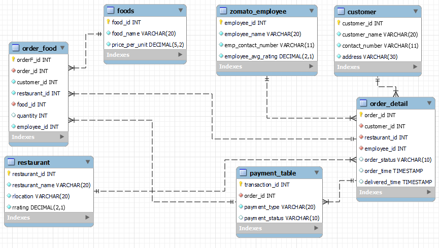

# 🍔 Zomato MySQL Data Analytics

<p align="center">
  
  
  
  
</p>

<p align="center">
  <strong>Relational Database Design • SQL Analytics • Business Analysis</strong>
</p>

<p align="center">
  A practical MySQL project focused on analyzing customers, restaurants,
  food items, orders, delivery performance, employees, and payments.
</p>

<p align="center">
  <a href="./zomato_database.sql">📄 View SQL Script</a>
  &nbsp;&nbsp;•&nbsp;&nbsp;
  <a href="./schema/zomato_schema.png">🗺️ View Database Schema</a>
</p>

---

# 📖 Project Overview

The **Zomato MySQL Data Analytics Project** is a relational database and SQL analysis project built to practice real-world data analysis using **MySQL**.

The database models a food-ordering and delivery environment containing information about:

- 👤 Customers
- 🍴 Restaurants
- 👨‍💼 Employees
- 🍕 Food Items
- 📦 Orders
- 💳 Payments
- 🛒 Ordered Food Items

The project combines **database design** with **SQL-based analysis** to answer practical questions related to customer behavior, restaurant performance, food demand, order activity, delivery time, employee ratings, and payment analysis.

This project is designed to demonstrate how a Data Analyst can use SQL to work with structured relational data and convert it into meaningful analytical results.

---

# 🎯 Project Objective

The main objective of this project is to build practical knowledge of **MySQL, SQL, relational database design, and data analytics**.

### Key objectives

- Design a relational database
- Create and manage multiple SQL tables
- Define Primary Key and Foreign Key relationships
- Insert and work with structured data
- Combine data using SQL JOINs
- Perform aggregations and calculations
- Analyze customer ordering behavior
- Analyze restaurant performance
- Analyze food-item popularity and pricing
- Analyze delivery performance
- Analyze employee ratings
- Analyze payment information
- Apply advanced SQL techniques

---

# 📊 Project Snapshot

| Category | Details |
|---|---|
| 🗄️ **Database** | `zomatodb` |
| 🐬 **DBMS** | MySQL |
| 📝 **Language** | SQL |
| 🗃️ **Tables** | 7 |
| 📊 **Analysis Questions** | 15 |
| 🔗 **Database Type** | Relational |
| 🖼️ **Schema** | Included |
| 📄 **SQL Script** | Included |
| 🧠 **Advanced SQL** | CTEs, Subqueries, CASE & Window Functions |

---

# 🗄️ Database Overview

The project creates a MySQL schema named:

```sql
zomatodb
```

The SQL script initializes the database using:

```sql
DROP SCHEMA IF EXISTS zomatodb;

CREATE SCHEMA zomatodb;

USE zomatodb;
```

The database is organized into seven related tables.

```text
Customer
   │
   ▼
Order Detail
   │
   ├──────────────► Restaurant
   │
   ├──────────────► Zomato Employee
   │
   ├──────────────► Payment
   │
   └──────────────► Order Food
                         │
                         ▼
                       Foods
```

This relational structure allows information from different entities to be combined and analyzed using SQL.

---

# 🏗️ Database Architecture

The database follows a relational design where individual business entities are stored in separate tables.

### Entity Overview

```text
                    ┌──────────────────┐
                    │     CUSTOMER     │
                    └────────┬─────────┘
                             │
                             │
                    ┌────────▼─────────┐
                    │   ORDER_DETAIL   │
                    └──────┬─┬───┬─────┘
                           │ │   │
             ┌─────────────┘ │   └──────────────┐
             │               │                  │
             ▼               ▼                  ▼
       ┌──────────┐   ┌───────────────┐  ┌──────────────┐
       │RESTAURANT│   │ZOMATO_EMPLOYEE│  │PAYMENT_TABLE │
       └──────────┘   └───────────────┘  └──────────────┘
                           │
                           │
                    ┌──────▼──────┐
                    │ ORDER_FOOD  │
                    └──────┬─────┘
                           │
                    ┌──────▼──────┐
                    │    FOODS     │
                    └──────────────┘
```

---

# 🗃️ Database Tables

The database contains **7 tables**.

| # | Table | Purpose |
|---:|---|---|
| 01 | `customer` | Stores customer information |
| 02 | `restaurant` | Stores restaurant information and ratings |
| 03 | `zomato_employee` | Stores employee information and ratings |
| 04 | `foods` | Stores food names and prices |
| 05 | `order_detail` | Stores order, customer, restaurant, employee and delivery information |
| 06 | `payment_table` | Stores payment transaction information |
| 07 | `order_food` | Connects orders with food items and quantities |

---

# 🖼️ Database Schema

The following Entity Relationship Diagram represents the database structure and relationships between the tables.

<p align="center">
  
</p>

<p align="center">
  <a href="./schema/zomato_schema.png">
    🔍 View Full-Size Schema
  </a>
</p>

---

# 🔗 Table Relationships

The database connects its major entities through foreign-key relationships.

### Customer → Order

```text
customer.customer_id
        │
        ▼
order_detail.customer_id
```

Connects customers with their orders.

---

### Restaurant → Order

```text
restaurant.restaurant_id
        │
        ▼
order_detail.restaurant_id
```

Connects restaurants with their associated orders.

---

### Employee → Order

```text
zomato_employee.employee_id
        │
        ▼
order_detail.employee_id
```

Connects employees with order delivery records.

---

### Order → Payment

```text
order_detail.order_id
        │
        ▼
payment_table.order_id
```

Connects payment transactions with orders.

---

### Order → Food

```text
order_detail.order_id
        │
        ▼
order_food.order_id
```

Connects orders with ordered food items.

---

### Food → Order Food

```text
foods.food_id
        │
        ▼
order_food.food_id
```

Connects food items with order records.

---

# 📈 Business Questions & Analysis

The SQL project contains **15 analytical questions**.

The questions cover customer behavior, restaurant performance, food analysis, order activity, delivery performance, employee ratings, and payments.

| # | Analysis | Purpose |
|---:|---|---|
| 01 | 🥇 Top 3 Customers by Orders | Identifies customers with the highest number of orders |
| 02 | ⭐ Highest Rated Restaurant | Finds the restaurant with the highest rating |
| 03 | 🚴 Orders Under 30 Minutes | Identifies orders delivered in less than 30 minutes |
| 04 | 💰 Revenue by Food Item | Calculates revenue generated by each food item |
| 05 | 🥈 Second Highest Revenue Restaurant | Identifies the second-highest revenue restaurant |
| 06 | 🍕 Top 5 Popular Food Items | Finds food items with the highest quantity sold |
| 07 | 👨‍💼 Top 3 Employees by Rating | Identifies the highest-rated employees |
| 08 | 📅 Highest Order Month | Finds the month with the highest order activity |
| 09 | 💵 Average Order Amount | Calculates average order value per customer |
| 10 | 👤 Frequent Customer by Restaurant | Identifies frequent customers for each restaurant |
| 11 | 🗓️ Weekend Orders | Calculates the number of weekend orders |
| 12 | ⏱️ Weekday vs Weekend Delivery | Compares average delivery time by day type |
| 13 | 💎 Most Expensive Food Items | Identifies the highest-priced food items |
| 14 | 🍴 Restaurant Menu Diversity | Finds restaurants with the most distinct food items |
| 15 | 💳 Payment Type Analysis | Calculates payment amounts by payment type |

---

## 🔍 Analysis Details

<details>
<summary><strong>01 — Top 3 Customers by Orders</strong></summary>

**Question:** Find the top 3 customers who placed the highest number of orders.

**Purpose:** Analyze customer ordering frequency.

**SQL Concepts:**

`COUNT()` • `GROUP BY` • `ORDER BY` • `LIMIT`

</details>

<details>
<summary><strong>02 — Highest Rated Restaurant</strong></summary>

**Question:** Find the restaurant with the highest rating.

**Purpose:** Identify the restaurant with the highest stored rating.

**SQL Concepts:**

`MAX()` • `Subquery` • `WHERE` • `ORDER BY` • `LIMIT`

</details>

<details>
<summary><strong>03 — Orders Delivered Under 30 Minutes</strong></summary>

**Question:** Find orders delivered in less than 30 minutes.

**Purpose:** Analyze fast delivery records.

**SQL Concepts:**

`TIMESTAMPDIFF()` • `WHERE`

</details>

<details>
<summary><strong>04 — Revenue by Food Item</strong></summary>

**Question:** Calculate total revenue generated by each food item.

**Calculation:**

```text
Revenue = Quantity × Price Per Unit
```

**SQL Concepts:**

`JOIN` • `SUM()` • `GROUP BY` • `ORDER BY`

</details>

<details>
<summary><strong>05 — Second Highest Revenue Restaurant</strong></summary>

**Question:** Find the restaurant with the second-highest revenue.

**Purpose:** Rank restaurants using calculated order value.

**SQL Concepts:**

`JOIN` • `SUM()` • `GROUP BY` • `ORDER BY` • `LIMIT` • `OFFSET`

</details>

<details>
<summary><strong>06 — Top 5 Popular Food Items</strong></summary>

**Question:** Find the five food items with the highest quantity sold.

**Purpose:** Analyze food-item demand.

**SQL Concepts:**

`JOIN` • `SUM()` • `GROUP BY` • `ORDER BY` • `LIMIT`

</details>

<details>
<summary><strong>07 — Top 3 Employees by Rating</strong></summary>

**Question:** Find the top 3 employees according to their rating.

**Purpose:** Analyze employee rating information.

**SQL Concepts:**

`ORDER BY` • `LIMIT`

</details>

<details>
<summary><strong>08 — Month with Highest Orders</strong></summary>

**Question:** Find the month with the highest number of orders.

**Purpose:** Analyze monthly order activity.

**SQL Concepts:**

`MONTHNAME()` • `COUNT()` • `GROUP BY` • `ORDER BY` • `LIMIT`

</details>

<details>
<summary><strong>09 — Average Order Amount per Customer</strong></summary>

**Question:** Calculate the average order amount for each customer.

**Calculation:**

```text
Order Amount = Quantity × Price Per Unit
```

**SQL Concepts:**

`JOIN` • `Subquery` • `SUM()` • `AVG()` • `ROUND()` • `GROUP BY`

</details>

<details>
<summary><strong>10 — Most Frequent Customer for Each Restaurant</strong></summary>

**Question:** Find the most frequent customer for each restaurant.

**Purpose:** Analyze customer-restaurant relationships.

**SQL Concepts:**

`JOIN` • `GROUP BY` • `RANK()` • `OVER()` • `PARTITION BY`

</details>

<details>
<summary><strong>11 — Weekend Order Count</strong></summary>

**Question:** Calculate the total number of weekend orders.

**Purpose:** Analyze order activity on weekends.

**SQL Concepts:**

`CTE` • `DAYNAME()` • `DAYOFWEEK()` • `WEEKDAY()` • `COUNT()`

</details>

<details>
<summary><strong>12 — Weekday vs Weekend Delivery Time</strong></summary>

**Question:** Compare average delivery time between weekdays and weekends.

**Purpose:** Analyze delivery duration by day type.

**SQL Concepts:**

`CASE` • `WHEN` • `TIMESTAMPDIFF()` • `AVG()` • `GROUP BY`

</details>

<details>
<summary><strong>13 — Top 5 Most Expensive Food Items</strong></summary>

**Question:** Find the five food items with the highest prices.

**Purpose:** Analyze food pricing.

**SQL Concepts:**

`ORDER BY` • `LIMIT` • `DENSE_RANK()`

</details>

<details>
<summary><strong>14 — Restaurant with Most Diverse Menu</strong></summary>

**Question:** Find the restaurant with the highest number of distinct food items.

**Purpose:** Compare restaurants based on distinct food items represented in the order data.

**SQL Concepts:**

`COUNT(DISTINCT)` • `JOIN` • `GROUP BY` • `Subquery` • `MAX()` • `HAVING`

</details>

<details>
<summary><strong>15 — Payment Amount by Payment Type</strong></summary>

**Question:** Calculate total payment amount for each payment type.

**Calculation:**

```text
Payment Amount = Quantity × Price Per Unit
```

**SQL Concepts:**

`JOIN` • `SUM()` • `GROUP BY`

</details>

---

# 🧠 SQL Concepts Used

The project demonstrates both **fundamental and advanced SQL techniques**.

### 🟢 Database Fundamentals

```text
CREATE SCHEMA
CREATE TABLE
DROP TABLE
USE
INSERT INTO
```

Used to create and populate the relational database.

---

### 🔵 Data Retrieval & Filtering

```text
SELECT
WHERE
HAVING
DISTINCT
ORDER BY
LIMIT
OFFSET
```

Used to retrieve, filter and organize analytical results.

---

### 🟣 Data Aggregation

```text
COUNT()
SUM()
AVG()
MAX()
GROUP BY
```

Used to calculate metrics and summarize data.

---

### 🟠 Table Relationships

```text
JOIN
Primary Keys
Foreign Keys
```

Used to combine information stored across multiple tables.

---

### 🔴 Advanced SQL

```text
Subqueries
CTEs
CASE
RANK()
DENSE_RANK()
OVER()
PARTITION BY
```

Used for complex analysis, classification and ranking.

---

### 🟡 Date & Time Analysis

```text
TIMESTAMPDIFF()
MONTHNAME()
DAYNAME()
DAYOFWEEK()
WEEKDAY()
```

Used for order and delivery-time analysis.

---

# 🛠️ Tools & Technologies

| Technology | Purpose |
|---|---|
| 🐬 **MySQL** | Relational database management |
| 📝 **SQL** | Database querying and analytics |
| 🖥️ **MySQL Workbench** | SQL development and execution |
| 🗄️ **Relational Database** | Structured data organization |
| 🔗 **Primary & Foreign Keys** | Establishing table relationships |

---

# 🔄 Project Workflow

The project follows a structured data-analysis workflow:

```text
        ┌──────────────────────┐
        │   Database Creation  │
        └──────────┬───────────┘
                   ↓
        ┌──────────────────────┐
        │    Table Creation    │
        └──────────┬───────────┘
                   ↓
        ┌──────────────────────┐
        │ Keys & Relationships │
        └──────────┬───────────┘
                   ↓
        ┌──────────────────────┐
        │     Insert Data      │
        └──────────┬───────────┘
                   ↓
        ┌──────────────────────┐
        │   Explore Database   │
        └──────────┬───────────┘
                   ↓
        ┌──────────────────────┐
        │      JOIN Tables     │
        └──────────┬───────────┘
                   ↓
        ┌──────────────────────┐
        │ Aggregate & Filter   │
        └──────────┬───────────┘
                   ↓
        ┌──────────────────────┐
        │   Advanced SQL       │
        │ CTE • CASE • Ranking │
        └──────────┬───────────┘
                   ↓
        ┌──────────────────────┐
        │   Analyze Results    │
        └──────────────────────┘
```

---

# ▶️ How to Run the Project

## 1. Install MySQL

Install:

- MySQL Server
- MySQL Workbench

Make sure the MySQL Server is running.

---

## 2. Download the SQL Project

Clone or download the portfolio repository and navigate to:

```text
MySQL/zomato-mysql-data-analytics/
```

The SQL script is:

```text
zomato_database.sql
```

---

## 3. Open MySQL Workbench

Launch **MySQL Workbench** and connect to your MySQL Server.

---

## 4. Open the SQL Script

From MySQL Workbench:

```text
File
   ↓
Open SQL Script
   ↓
zomato_database.sql
```

---

## 5. Execute the Script

Click the **Execute** button in MySQL Workbench.

The script will create the database, tables, relationships, data and analysis queries contained in the SQL file.

---

## 6. Refresh the Schema

Refresh the **Schemas** panel.

You should see:

```text
zomatodb
│
├── customer
├── restaurant
├── zomato_employee
├── foods
├── order_detail
├── payment_table
└── order_food
```

---

## 7. Run the Analysis Queries

The SQL file contains 15 analysis questions.

You can execute the queries individually to understand:

```text
Customer Analysis
Restaurant Analysis
Food Analysis
Order Analysis
Delivery Analysis
Employee Analysis
Payment Analysis
```

---

# 📥 How to Download

## Option 1 — Download ZIP

1. Open the GitHub repository.
2. Click **Code**.
3. Select **Download ZIP**.
4. Extract the downloaded ZIP file.
5. Open:

```text
Data-Analytics-Portfolio/
└── MySQL/
    └── zomato-mysql-data-analytics/
```

---

## Option 2 — Clone Using Git

Run:

```bash
git clone https://github.com/YogirajSharma/Data-Analytics-Portfolio.git
```

Then navigate to:

```text
Data-Analytics-Portfolio/MySQL/zomato-mysql-data-analytics/
```

---

# 🎓 Key Learning Areas

This project provides practical experience in the following areas:

### 🗄️ Relational Database Design

Understanding how real-world entities can be organized into related tables.

### 🔑 Keys & Relationships

Understanding the role of Primary Keys and Foreign Keys.

### 🔗 SQL JOINs

Combining data from multiple relational tables.

### 📊 Aggregation

Using:

```sql
COUNT()
SUM()
AVG()
MAX()
```

to calculate analytical metrics.

### 🧩 Subqueries & CTEs

Breaking down complex SQL analysis into manageable queries.

### 🏆 Window Functions

Using ranking functions such as:

```sql
RANK()
DENSE_RANK()
```

### 📌 PARTITION BY

Performing ranking and calculations within groups.

### 🔀 CASE Expressions

Creating conditional categories such as weekday and weekend.

### 📅 Date & Time Analysis

Analyzing order and delivery timestamps.

### 💰 Revenue Analysis

Calculating order and food-level values.

### 👤 Customer Analytics

Understanding customer order frequency and average order value.

### 🍴 Restaurant Analytics

Analyzing restaurant ratings, revenue and menu diversity.

### 🍕 Food Analytics

Analyzing food popularity, pricing and quantity sold.

### 💳 Payment Analytics

Analyzing calculated payment amounts by payment type.

---

# 💼 Skills Demonstrated

<p align="center">


</p>

### Technical Skills

- MySQL
- SQL
- Relational Database Design
- Database Schema Design
- Primary Keys
- Foreign Keys
- SQL JOINs
- Aggregate Functions
- GROUP BY
- WHERE & HAVING
- ORDER BY
- Subqueries
- Common Table Expressions
- CASE Expressions
- Window Functions
- RANK & DENSE_RANK
- PARTITION BY
- Date & Time Functions
- Customer Analytics
- Restaurant Analytics
- Food Analytics
- Order Analytics
- Payment Analytics

---

# 📂 Project Structure

```text
zomato-mysql-data-analytics/
│
├── 📄 zomato_database.sql
│
├── 📁 schema/
│   └── 🖼️ zomato_schema.png
│
└── 📄 README.md
```

### File Details

| File | Description |
|---|---|
| `zomato_database.sql` | Complete MySQL database, sample data and SQL analysis |
| `schema/zomato_schema.png` | Database schema and table relationships |
| `README.md` | Project documentation |

---

# 🔗 Quick Links

<p align="center">

<a href="./zomato_database.sql">

</a>

<a href="./schema/zomato_schema.png">

</a>

</p>

---

# ⚠️ Important Note

The SQL script contains:

```sql
DROP SCHEMA IF EXISTS zomatodb;
```

Therefore, if a schema named `zomatodb` already exists, it will be dropped before the project database is recreated.

> **⚠️ Important:** Do not run the complete script against an existing `zomatodb` schema containing important data.

For a learning or portfolio environment, this allows the project database to be recreated from scratch.

---

# 🏁 Conclusion

The **Zomato MySQL Data Analytics Project** demonstrates how SQL can be used to design, manage and analyze a relational database.

The project covers multiple business entities including:

```text
Customers
Restaurants
Employees
Food Items
Orders
Payments
```

Through **15 analytical questions**, the project applies SQL to explore customer ordering behavior, restaurant performance, food demand, delivery times, employee ratings, order trends and payment analysis.

The project also demonstrates a range of SQL techniques, from fundamental concepts such as:

```text
SELECT
WHERE
GROUP BY
ORDER BY
JOIN
COUNT()
SUM()
AVG()
```

to advanced concepts such as:

```text
Subqueries
CTEs
CASE
RANK()
DENSE_RANK()
OVER()
PARTITION BY
```

Overall, this project provides practical experience in **MySQL, SQL Data Analytics, relational database design and business-oriented data analysis**.

---

# 📌 Project Summary

| Metric | Value |
|---|---:|
| 🗄️ Database | `zomatodb` |
| 📋 Tables | **7** |
| 📊 Analysis Questions | **15** |
| 🐬 DBMS | **MySQL** |
| 📝 Query Language | **SQL** |
| 🖼️ Schema | **Included** |
| 🧠 Advanced SQL | **CTE • Subquery • CASE • Window Functions** |

---

<p align="center">

<strong>🍔 Zomato MySQL Data Analytics</strong>

<br>

<sub>
MySQL • SQL • Database Design • Data Analytics
</sub>

<br><br>

<a href="https://github.com/YogirajSharma/Data-Analytics-Portfolio">

</a>

</p>
