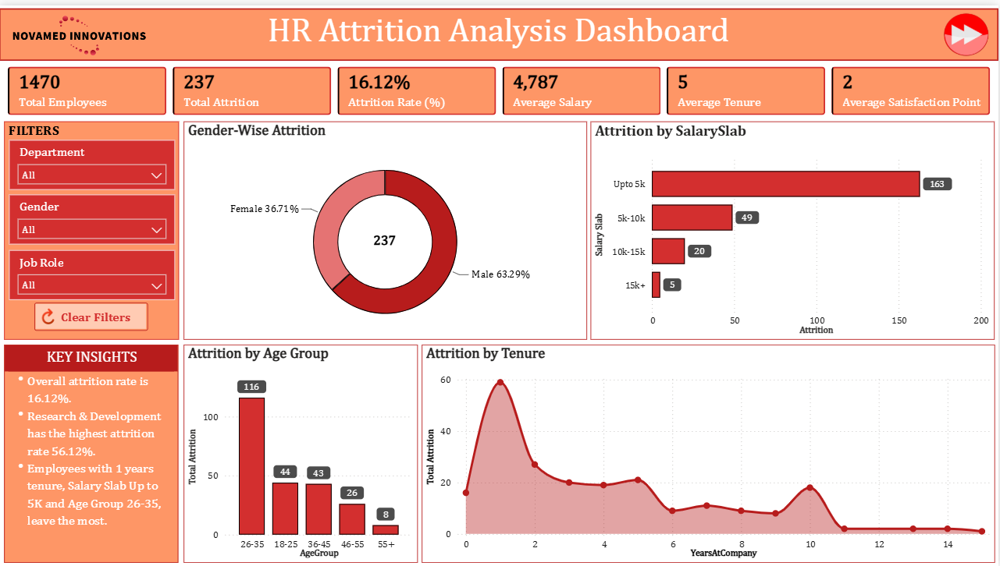
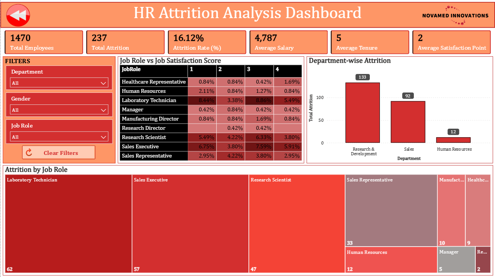

# 🏢 HR Attrition Analysis Dashboard — Power BI
<p align="center"> <b>HR Attrition Overview Dashboard</b> </p> <p align="center"> <p align="center">  </p>
</p> <p align="center"> <b>Detailed HR Attrition Analysis Dashboard</b> </p><p align="center"> 
  <b>Interactive Power BI Dashboard for Employee Attrition, Salary, Tenure & Workforce Analysis</b>
</p>

<p align="center">
  📊 Data Analysis &nbsp;•&nbsp;
  📈 Data Visualization &nbsp;•&nbsp;
  👥 HR Analytics &nbsp;•&nbsp;
  🎛️ Interactive Dashboard &nbsp;•&nbsp;
  📊 Power BI &nbsp;•&nbsp;
  🧮 DAX
</p>

---

## 📌 Project Overview

The **HR Attrition Analysis Dashboard** is an interactive Microsoft Power BI
dashboard developed to analyze employee attrition, workforce demographics,
salary levels, tenure, job roles, departments, and employee satisfaction.

The dashboard transforms HR employee data into meaningful KPIs,
interactive visualizations, and analytical insights to understand
employee attrition patterns across different workforce segments.

The project contains two dashboard pages:

- 📊 HR Attrition Overview
- 📈 Detailed HR Attrition Analysis

---

## 🎯 Project Objective

The primary objective of this project is to analyze employee attrition
and identify patterns across different employee characteristics.

The dashboard focuses on:

👥 Employee workforce

📉 Employee attrition

📊 Attrition rate

💰 Salary analysis

⏳ Employee tenure

😊 Employee satisfaction

⚧️ Gender-wise attrition

🎂 Age group-wise attrition

💼 Job role-wise attrition

🏢 Department-wise attrition

📊 Salary slab-wise attrition

---

## 📊 Key Metrics

<table>

<tr>

<td align="center" width="16%">

👥

### 1,470

Total Employees

</td>

<td align="center" width="16%">

📉

### 237

Total Attrition

</td>

<td align="center" width="16%">

📊

### 16.12%

Attrition Rate

</td>

<td align="center" width="16%">

💰

### 4,787

Average Salary

</td>

<td align="center" width="16%">

⏳

### 5

Average Tenure

</td>

<td align="center" width="16%">

😊

### 2

Average Satisfaction

</td>

</tr>

</table>

---

## 📈 Dashboard Analysis

### 👥 Employee Overview

Provides an overall view of the employee workforce and key HR metrics.

The analysis includes:

- Total Employees
- Total Attrition
- Attrition Rate
- Average Salary
- Average Tenure
- Average Satisfaction Score

---

### ⚧️ Gender-wise Attrition

Analyzes employee attrition based on gender.

The dashboard provides a comparison between:

- Male Attrition
- Female Attrition

The visualization helps understand the distribution of attrition
across gender segments.

---

### 💰 Attrition by Salary Slab

Analyzes employee attrition across different salary ranges.

Salary slabs include:

- Up to 5K
- 5K–10K
- 10K–15K
- 15K+

This analysis helps explore how attrition varies across different
salary ranges.

---

### 🎂 Attrition by Age Group

Analyzes employee attrition across different age groups.

The dashboard includes:

- 18–25
- 26–35
- 36–45
- 46–55
- 55+

This helps identify attrition patterns across employee age segments.

---

### ⏳ Attrition by Tenure

Analyzes employee attrition according to the number of years
employees have spent with the organization.

The analysis helps explore:

- Early-stage employee attrition
- Mid-tenure attrition
- Long-tenure attrition
- Attrition patterns across years at company

---

## 📊 Detailed Dashboard Analysis

### 💼 Job Role vs Job Satisfaction

The second dashboard page analyzes the relationship between
job roles and employee satisfaction scores.

The analysis includes:

- Job Role
- Satisfaction Score 1
- Satisfaction Score 2
- Satisfaction Score 3
- Satisfaction Score 4

This provides a detailed view of satisfaction levels across
different job roles.

---

### 🏢 Department-wise Attrition

Analyzes employee attrition across departments.

Departments represented include:

- Research & Development
- Sales
- Human Resources

This visualization helps compare attrition levels across
different organizational departments.

---

### 💼 Attrition by Job Role

A treemap is used to visualize attrition across different
job roles.

The analysis includes roles such as:

- Laboratory Technician
- Sales Executive
- Research Scientist
- Sales Representative
- Human Resources
- Manager
- Healthcare Representative
- Manufacturing-related roles
- Research-related roles

The visualization provides a comparative view of attrition
across job roles.

---

## 🎛️ Interactive Filters

The dashboard provides interactive slicers for:

- 🏢 Department
- ⚧️ Gender
- 💼 Job Role

These filters allow users to explore attrition patterns for
specific employee segments.

A **Clear Filters** option is also provided for resetting
the selected filters.

---

## 🧩 Dashboard Components

### 📌 KPI Section

Provides a quick overview of major HR metrics:

- 👥 Total Employees
- 📉 Total Attrition
- 📊 Attrition Rate
- 💰 Average Salary
- ⏳ Average Tenure
- 😊 Average Satisfaction Point

---

### ⚧️ Demographic Analysis

Provides employee attrition analysis based on:

- Gender
- Age Group

---

### 💰 Salary Analysis

Analyzes attrition across different salary slabs.

---

### ⏳ Tenure Analysis

Analyzes employee attrition based on years spent with
the organization.

---

### 🏢 Department Analysis

Provides department-level attrition analysis.

---

### 💼 Job Role Analysis

Analyzes employee attrition across different job roles.

---

### 😊 Satisfaction Analysis

Analyzes job satisfaction scores across different job roles.

---

## 🛠️ Tools & Technologies

### 📊 Microsoft Power BI

Used as the primary platform for:

- HR data analysis
- Dashboard development
- Data visualization
- KPI creation
- Interactive reporting

---

### 🧹 Power Query

Used for data preparation and transformation.

Key activities include:

- Data cleaning
- Data transformation
- Data type management
- Column preparation
- Data preparation for analysis

---

### 🧮 DAX

DAX is used for analytical calculations and KPI development.

The dashboard uses calculations for:

- Total Employees
- Total Attrition
- Attrition Rate
- Average Salary
- Average Tenure
- Average Satisfaction
- Attrition analysis

---

### 📈 Data Visualization

Power BI visuals are used to transform HR data into
interactive business insights.

The dashboard includes:

- KPI Cards
- Donut Chart
- Bar Chart
- Column Chart
- Line Chart
- Matrix
- Treemap
- Slicers

---

## 📂 Project Structure

```text
HR-Attrition-Analysis/
│
├── 📊 HR_Attrition_Analysis.pbix
│   └── Main Power BI report containing the complete HR
│       attrition dashboard, data model, DAX measures,
│       Power Query transformations, and visualizations.
│
├── 📁 Images/
│   │
│   ├── 🖼️ HR_Attrition_Analysis_Dashboard.png
│   │   └── Main dashboard preview.
│   │
│   └── 🖼️ HR_Attrition_Analysis_Detailed.png
│       └── Detailed analysis dashboard preview.
│
└── 📄 README.md
    └── Project documentation and dashboard overview.
