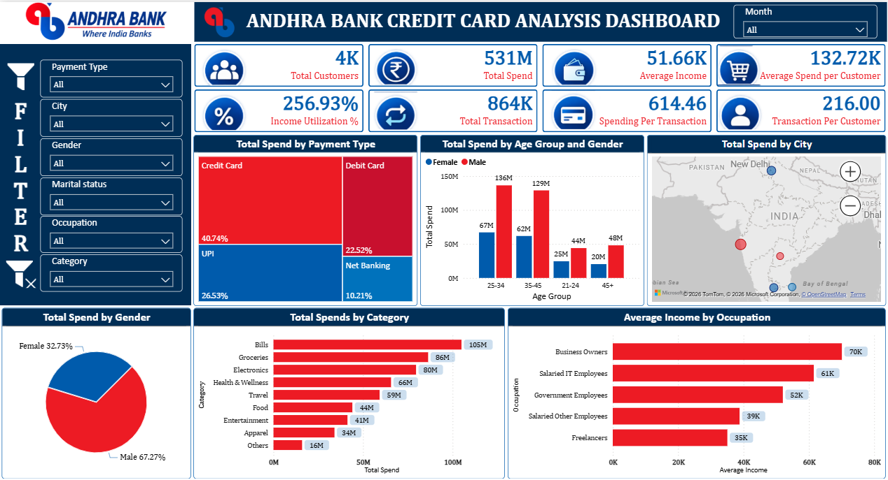

# 📊 Power BI Data Analytics Projects

<p align="center">
  
  
  
  
</p>

<p align="center">
  <strong>Interactive Power BI dashboards and data analytics projects focused on data visualization, KPI reporting, business analysis, trend analysis, and actionable insights.</strong>
</p>

---

## 📌 About This Folder

This folder contains my **Power BI Data Analytics projects**, developed to demonstrate practical skills in business intelligence, data visualization, dashboard development, data transformation, and analytical reporting.

These projects showcase how Power BI can be used to transform raw data into **interactive dashboards, meaningful KPIs, business insights, and decision-support reports**.

### 💡 Skills Demonstrated

- 🧹 Data Cleaning & Preparation
- 🔄 Power Query
- 📊 Data Analysis
- 📐 DAX
- 🗂️ Data Modeling
- 🎯 KPI Development
- 🎛️ Interactive Slicers & Filters
- 📈 Trend Analysis
- 💰 Revenue & Cost Analysis
- 👥 Customer & Employee Analysis
- 🛠️ Operational Analysis
- 📊 Dashboard Development
- 💡 Business Insights
- 📋 Business Intelligence Reporting

Each project contains a Power BI `.pbix` file, dashboard screenshots, and a detailed project README.

---

# 📁 Projects

| # | Project | Power BI File | Dashboard Preview |
|---|---|---|---|
| 1 | **Andhra Bank Credit Card Analysis** | [📊 PBIX File](./Andhra-Bank-Creadit-Card-Analysis/Andhra_Bank_Credit_Card_Analysis.pbix) | [🖼️ Images](./Andhra-Bank-Creadit-Card-Analysis/Images/) |
| 2 | **HR Attrition Analysis** | [📊 PBIX File](./HR-Attrition-Analysis/HR_Attrition_Analysis.pbix) | [🖼️ Images](./HR-Attrition-Analysis/Images/) |
| 3 | **Work Order Analysis** | [📊 PBIX File](./Work-Order-Analysis/Work_Order_Analysis.pbix) | [🖼️ Images](./Work-Order-Analysis/Images/) |

---

# 🏦 01. Andhra Bank Credit Card Analysis

<p align="center">
  <a href="./Andhra-Bank-Creadit-Card-Analysis/">
    
  </a>
</p>

### 📌 Project Overview

An interactive Power BI dashboard designed to analyze **credit card customer behavior, spending patterns, transactions, income, payment methods, cities, occupations, and spending categories**.

The dashboard provides a comprehensive view of customer spending and transaction behavior through interactive filters and visualizations.

### 📊 Key Metrics

- 👥 Total Customers — **4K**
- 💰 Total Spend — **531M**
- 💵 Average Income — **51.66K**
- 💳 Average Spend per Customer — **132.72K**
- 📈 Income Utilization — **256.93%**
- 🔄 Total Transactions — **864K**
- 💸 Spending per Transaction — **614.46**
- 👤 Transactions per Customer — **216**

### 🔍 Analysis Areas

- Total Spend by Payment Type
- Total Spend by Age Group & Gender
- Total Spend by City
- Total Spend by Gender
- Total Spend by Category
- Average Income by Occupation
- Customer Demographics
- Transaction Analysis
- Spending Behavior
- Payment Type Analysis

### 🎛️ Interactive Filters

- Month
- Payment Type
- City
- Gender
- Marital Status
- Occupation
- Category

### 🔗 Project Links

👉 [View Andhra Bank Credit Card Analysis](./Andhra-Bank-Creadit-Card-Analysis/)

👉 [Open Power BI Workbook](./Andhra-Bank-Creadit-Card-Analysis/Andhra_Bank_Credit_Card_Analysis.pbix)

👉 [View Dashboard Images](./Andhra-Bank-Creadit-Card-Analysis/Images/)

👉 [Open Project README](./Andhra-Bank-Creadit-Card-Analysis/README.md)

---

# 🏢 02. HR Attrition Analysis

<p align="center">
  <a href="./HR-Attrition-Analysis/">
    
  </a>
</p>

### 📌 Project Overview

An interactive HR analytics dashboard designed to analyze **employee attrition, salary, age, tenure, department, job role, gender, and job satisfaction**.

The dashboard helps explore employee attrition patterns and understand how different employee characteristics relate to workforce turnover.

### 📊 Key Metrics

- 👥 Total Employees — **1,470**
- 🚪 Total Attrition — **237**
- 📉 Attrition Rate — **16.12%**
- 💰 Average Salary — **4,787**
- 📅 Average Tenure — **5**
- ⭐ Average Satisfaction — **2**

### 🔍 Analysis Areas

- Gender-wise Attrition
- Attrition by Salary Slab
- Attrition by Age Group
- Attrition by Tenure
- Department-wise Attrition
- Attrition by Job Role
- Job Role vs Job Satisfaction
- Employee Demographics
- Salary Analysis
- Workforce Analysis

### 🎛️ Interactive Filters

- Department
- Gender
- Job Role
- Clear Filters

### 🔗 Project Links

👉 [View HR Attrition Analysis](./HR-Attrition-Analysis/)

👉 [Open Power BI Workbook](./HR-Attrition-Analysis/HR_Attrition_Analysis.pbix)

👉 [View Dashboard Images](./HR-Attrition-Analysis/Images/)

👉 [Open Project README](./HR-Attrition-Analysis/README.md)

---

# 🛠️ 03. Work Order Analysis

<p align="center">
  <a href="./Work-Order-Analysis/">
    
  </a>
</p>

### 📌 Project Overview

An interactive Power BI dashboard designed to analyze **work orders, services, districts, technicians, revenue, costs, payment types, labour hours, waiting time, and warranty information**.

The dashboard provides an operational view of work-order performance and allows users to analyze service demand, geographical performance, revenue, costs, and workforce allocation.

### 📊 Key Metrics

- 📝 Total Work Orders — **1,000**
- ⏳ Average Waiting Time — **28.02**
- 🚨 Rush Job Percentage — **10.30%**
- 💰 Total Revenue — **237K**
- 👷 Labour Hour Average — **0.77**
- 💵 Total Cost — **268.30K**

### 🔍 Analysis Areas

- Work Order by Service
- Work Order by District
- District-wise Revenue
- Work Trend Over Time
- Technician by Service
- Total Cost by Service
- Average Technicians by Service
- Client Payment Preferences
- Labour Warranty Analysis
- Average Parts Cost by Service
- Revenue by Payment Type

### 🎛️ Interactive Filters

- Service
- Payment Type
- Year
- District

### 🔗 Project Links

👉 [View Work Order Analysis](./Work-Order-Analysis/)

👉 [Open Power BI Workbook](./Work-Order-Analysis/Work_Order_Analysis.pbix)

👉 [View Dashboard Image](./Work-Order-Analysis/Images/)

👉 [Open Project README](./Work-Order-Analysis/README.md)

---

# 🛠️ Tools & Technologies

| Tool / Feature | Purpose |
|---|---|
| 📊 **Microsoft Power BI** | Dashboard development and business intelligence |
| 🔄 **Power Query** | Data cleaning and transformation |
| 📐 **DAX** | Measures, KPIs, and analytical calculations |
| 🗂️ **Data Modeling** | Relationships and analytical data models |
| 📈 **Data Visualization** | Interactive charts and reports |
| 🎛️ **Slicers** | Interactive filtering |
| 🎯 **KPI Cards** | Performance monitoring |
| 📊 **Tables & Matrices** | Detailed data analysis |
| 💡 **Business Analysis** | Generating meaningful business insights |

---

# 📁 Power BI Directory Structure
```
Power-BI/
│
├── README.md
│
├── Andhra-Bank-Creadit-Card-Analysis/
│   ├── README.md
│   ├── Andhra_Bank_Credit_Card_Analysis.pbix
│   └── Images/
│       └── Andhra_Bank_Credit_Card_Dashboard.png
│
├── HR-Attrition-Analysis/
│   ├── README.md
│   ├── HR_Attrition_Analysis.pbix
│   └── Images/
│       ├── HR_Attrition_Analysis_Dashboard.png
│       └── HR_Attrition_Analysis_Detailed.png
│
└── Work-Order-Analysis/
    ├── README.md
    ├── Work_Order_Analysis.pbix
    └── Images/
        └── Work_Order_Analysis_Dashboard.png
```
