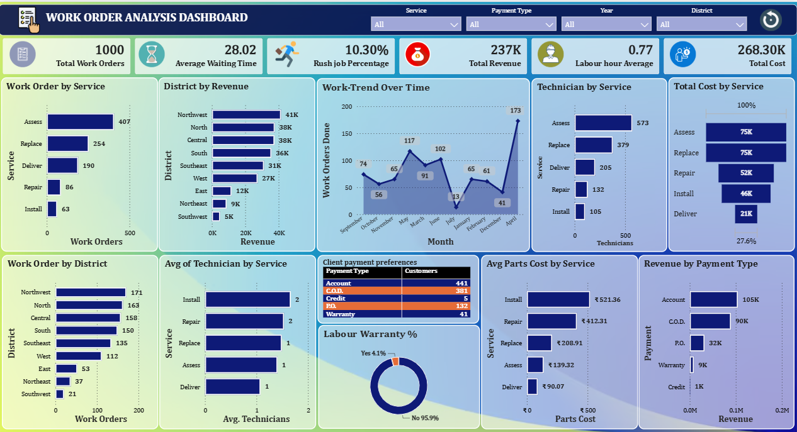

# 🛠️ Work Order Analysis Dashboard — Power BI

<p align="center">
  
</p>

<p align="center">
  <strong>Interactive Power BI Dashboard for Work Order, Revenue, Cost & Technician Analysis</strong>
</p>

<p align="center">
  📊 Power BI &nbsp; | &nbsp;
  🔄 Power Query &nbsp; | &nbsp;
  📐 DAX &nbsp; | &nbsp;
  📈 Data Visualization
</p>

---

## 📌 Project Overview

The **Work Order Analysis Dashboard** is an interactive Power BI project designed to analyze work order performance across different services, districts, technicians, payment types, costs, and revenue.

The dashboard provides a consolidated view of operational performance and helps users understand work-order volume, service demand, revenue generation, labour utilization, and cost distribution.

Interactive filters allow users to analyze the report by:

- Service
- Payment Type
- Year
- District

---

## 🎯 Project Objective

The main objectives of this dashboard are to:

- Analyze total work orders
- Monitor average waiting time
- Measure rush job percentage
- Analyze total revenue
- Evaluate labour hour performance
- Monitor total operational cost
- Compare work orders across services
- Analyze district-wise performance
- Track work-order trends over time
- Analyze technician distribution by service
- Compare cost and revenue across services and payment types

---

## 📊 Key Metrics

| KPI | Value |
|---|---:|
| 📝 Total Work Orders | **1,000** |
| ⏳ Average Waiting Time | **28.02** |
| 🚨 Rush Job Percentage | **10.30%** |
| 💰 Total Revenue | **237K** |
| 👷 Labour Hour Average | **0.77** |
| 💵 Total Cost | **268.30K** |

---

# 📈 Dashboard Analysis

## 1️⃣ Work Order by Service

Shows the number of work orders handled by each service.

The dashboard compares:

- Assess
- Replace
- Deliver
- Repair
- Install

This helps identify which services generate the highest work-order volume.

---

## 2️⃣ District by Revenue

Displays revenue generated across different districts.

The dashboard compares:

- Northwest
- North
- Central
- South
- Southeast
- West
- East
- Northeast
- Southwest

This provides a geographical view of revenue performance.

---

## 3️⃣ Work Trend Over Time

The line chart shows the number of work orders completed across different months.

It helps identify:

- Monthly work-order trends
- High-volume periods
- Low-volume periods
- Changes in operational demand

---

## 4️⃣ Technician by Service

Shows the number of technicians associated with different services.

This helps understand technician allocation across:

- Assess
- Replace
- Deliver
- Repair
- Install

---

## 5️⃣ Total Cost by Service

Compares total cost across different services.

This helps identify the services contributing most to overall operational costs.

---

## 6️⃣ Work Order by District

Shows the number of work orders handled by each district.

This helps compare operational workload across geographical regions.

---

## 7️⃣ Average Technicians by Service

Displays the average number of technicians associated with each service.

This can be used to understand workforce allocation and service-level requirements.

---

## 8️⃣ Client Payment Preferences

Shows customer distribution across different payment types:

- Account
- C.O.D.
- Credit
- P.O.
- Warranty

This provides an overview of client payment preferences.

---

## 9️⃣ Labour Warranty Analysis

The dashboard compares work orders under labour warranty.

The visual displays:

- Warranty Yes
- Warranty No

This helps understand the proportion of work associated with labour warranty.

---

## 🔟 Average Parts Cost by Service

Compares the average parts cost for each service.

This helps identify services with higher average parts expenditure.

---

## 1️⃣1️⃣ Revenue by Payment Type

Shows revenue generated through different payment methods.

This helps analyze the contribution of different payment types to total revenue.

---

# 🎛️ Interactive Filters

The dashboard contains interactive slicers for:

- **Service**
- **Payment Type**
- **Year**
- **District**

Users can select different filter combinations to dynamically analyze the dashboard.

---

# 🧩 Dashboard Components

The dashboard includes:

- KPI Cards
- Bar Charts
- Line Chart
- Donut Chart
- Table
- Interactive Slicers
- Trend Analysis
- Cost Analysis
- Revenue Analysis
- Service Analysis
- District Analysis

---

# 🛠️ Tools & Technologies

| Tool | Purpose |
|---|---|
| 📊 Power BI | Dashboard Development |
| 🔄 Power Query | Data Cleaning & Transformation |
| 📐 DAX | Calculations & Measures |
| 📈 Data Visualization | Charts & Interactive Reporting |

---

# 📁 Project Structure

```text
Work-Order-Analysis/
│
├── README.md
├── Work_Order_Analysis.pbix
│
└── Images/
    └── Work_Order_Analysis_Dashboard.png
